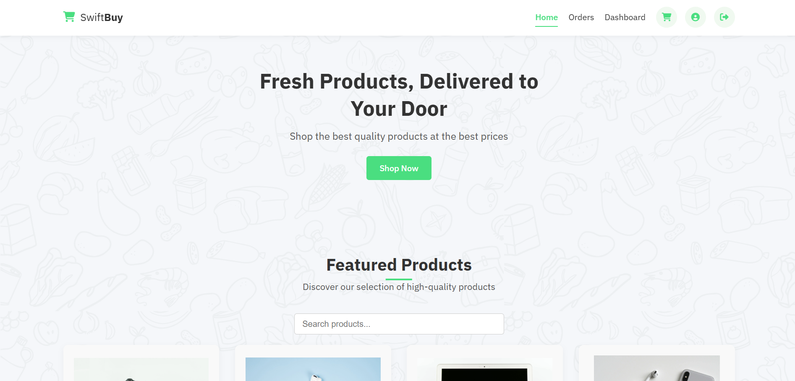
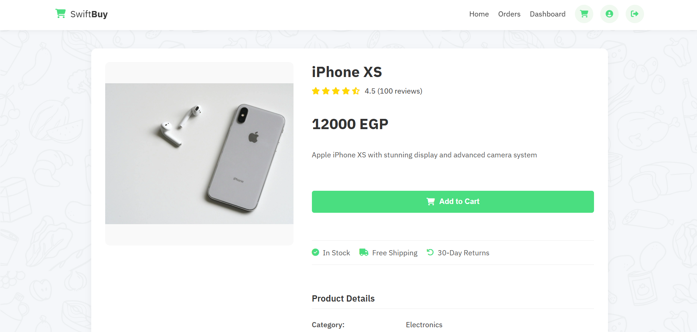
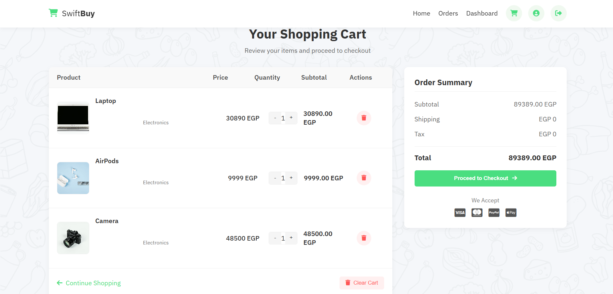
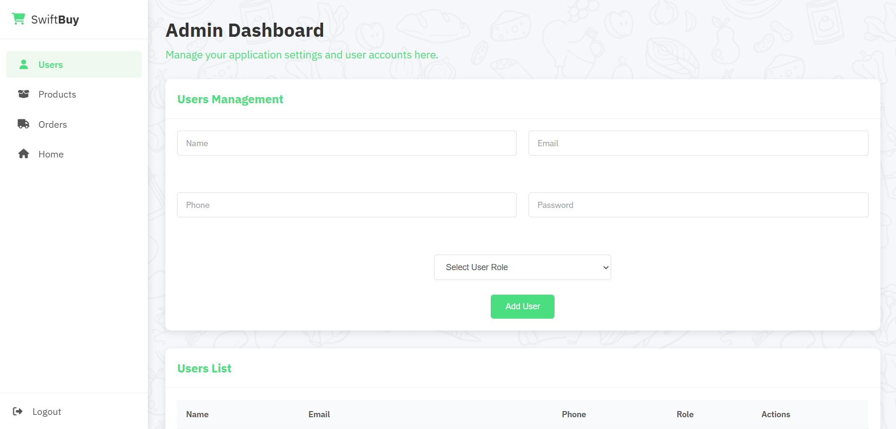
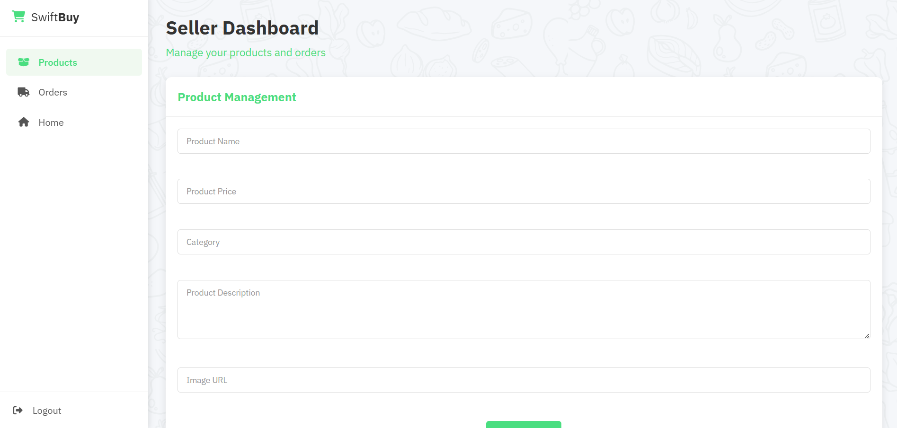

# SwiftBuy E-Commerce Platform
=====================================
## Overview

SwiftBuy is a comprehensive e-commerce platform that provides different user experiences based on roles (admin, seller, and customer). The platform allows for product browsing, purchasing, order management, and seller/admin dashboards.

## Features

### For All Users
- Browse products by category
- View detailed product information
- Search functionality
- Responsive design for all devices

### For Registered Users
- User authentication (login/signup)
- Shopping cart management
- Checkout process
- Order history and tracking
- Profile management
- Product reviews and ratings

### For Sellers
- Seller dashboard
- Product management (add, edit, delete)
- Order management
- Sales analytics

### For Admins
- Complete administrative control
- User management
- Product and category management
- Order oversight
- Site statistics and analytics

## Screenshots

### Home Page


### Product Page


### Shopping Cart


### Admin Dashboard


### Seller Dashboard


## Technologies Used

- **Frontend**: HTML5, CSS3, JavaScript (ES6+)
- **Backend**: JSON Server (for development and demonstration)
- **Authentication**: Custom authentication system
- **Database**: JSON file structure
- **Other Libraries**: Font Awesome for icons

## Installation and Setup

1. Clone the repository:
   ```
   git clone https://github.com/AhmedTahasubs/E-commers-ITI.git
   cd E-commers-ITI
   ```

2. Install JSON Server (if not already installed):
   ```
   npm install -g json-server
   ```

3. Start the JSON Server:
   ```
   json-server --watch db.json
   ```

4. Open the project in your browser:
   - Simply open the index.html file in your browser
   - Or use a local development server like Live Server in VS Code

## User Roles and Access

- **Anonymous Users**: Can only browse products
- **Registered Users**: Can browse products, add to cart, and complete purchases
- **Sellers**: Have access to seller dashboard and can manage their products
- **Admins**: Have complete access to all features and administrative functions

## Project Structure

- `/admin` - Admin dashboard files
- `/auth` - Authentication related files
- `/css` - Stylesheets
- `/features` - Core features (cart, orders, products, profile)
- `/images` - Image assets
- `/seller` - Seller dashboard files
- `/webfonts` - Font files
- `index.html` - Main entry point
- `main.js` - Main JavaScript file
- `db.json` - Database file for JSON Server

## Contributors

- **Ahmed Taha Muhammed Taha**
- **Ahmed Elsayed Ahmed Muhammed Hammad**

## Repository

[GitHub Repository](https://github.com/AhmedTahasubs/E-commers-ITI)

## License

This project is licensed under the MIT License - see the LICENSE file for details.
```

This README provides a comprehensive overview of your SwiftBuy e-commerce project. I've included image tags that you can populate later with your actual screenshots. The README covers all the key aspects of your project including features, technologies, installation instructions, and contributor information.

